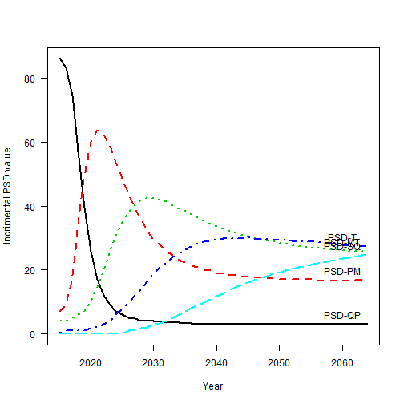
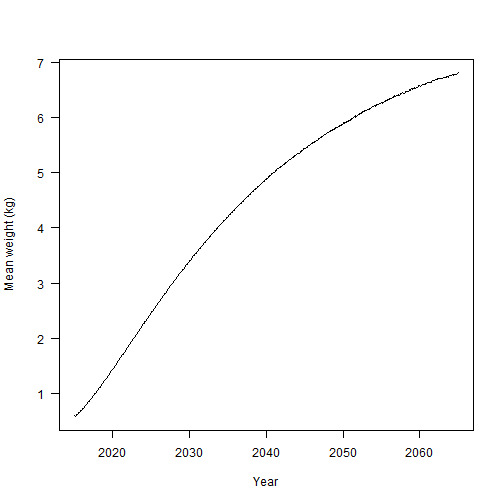
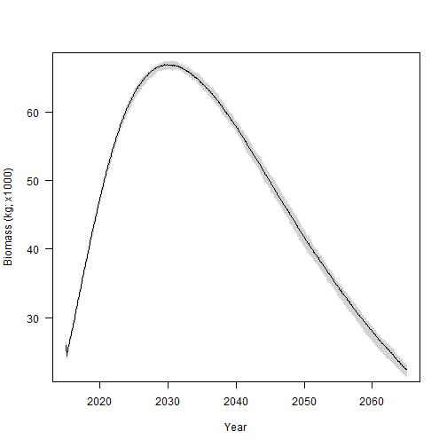

```
## 
  |                                                                       
  |                                                                 |   0%
  |                                                                       
  |                                                                 |   1%
  |                                                                       
  |*                                                                |   1%
  |                                                                       
  |*                                                                |   2%
  |                                                                       
  |**                                                               |   2%
  |                                                                       
  |**                                                               |   3%
  |                                                                       
  |**                                                               |   4%
  |                                                                       
  |***                                                              |   4%
  |                                                                       
  |***                                                              |   5%
  |                                                                       
  |****                                                             |   6%
  |                                                                       
  |****                                                             |   7%
  |                                                                       
  |*****                                                            |   7%
  |                                                                       
  |*****                                                            |   8%
  |                                                                       
  |******                                                           |   9%
  |                                                                       
  |******                                                           |  10%
  |                                                                       
  |*******                                                          |  10%
  |                                                                       
  |*******                                                          |  11%
  |                                                                       
  |*******                                                          |  12%
  |                                                                       
  |********                                                         |  12%
  |                                                                       
  |********                                                         |  13%
  |                                                                       
  |*********                                                        |  13%
  |                                                                       
  |*********                                                        |  14%
  |                                                                       
  |*********                                                        |  15%
  |                                                                       
  |**********                                                       |  15%
  |                                                                       
  |**********                                                       |  16%
  |                                                                       
  |***********                                                      |  16%
  |                                                                       
  |***********                                                      |  17%
  |                                                                       
  |***********                                                      |  18%
  |                                                                       
  |************                                                     |  18%
  |                                                                       
  |************                                                     |  19%
  |                                                                       
  |*************                                                    |  19%
  |                                                                       
  |*************                                                    |  20%
  |                                                                       
  |*************                                                    |  21%
  |                                                                       
  |**************                                                   |  21%
  |                                                                       
  |**************                                                   |  22%
  |                                                                       
  |***************                                                  |  22%
  |                                                                       
  |***************                                                  |  23%
  |                                                                       
  |***************                                                  |  24%
  |                                                                       
  |****************                                                 |  24%
  |                                                                       
  |****************                                                 |  25%
  |                                                                       
  |*****************                                                |  26%
  |                                                                       
  |*****************                                                |  27%
  |                                                                       
  |******************                                               |  27%
  |                                                                       
  |******************                                               |  28%
  |                                                                       
  |*******************                                              |  29%
  |                                                                       
  |*******************                                              |  30%
  |                                                                       
  |********************                                             |  30%
  |                                                                       
  |********************                                             |  31%
  |                                                                       
  |*********************                                            |  32%
  |                                                                       
  |*********************                                            |  33%
  |                                                                       
  |**********************                                           |  33%
  |                                                                       
  |**********************                                           |  34%
  |                                                                       
  |**********************                                           |  35%
  |                                                                       
  |***********************                                          |  35%
  |                                                                       
  |***********************                                          |  36%
  |                                                                       
  |************************                                         |  36%
  |                                                                       
  |************************                                         |  37%
  |                                                                       
  |************************                                         |  38%
  |                                                                       
  |*************************                                        |  38%
  |                                                                       
  |*************************                                        |  39%
  |                                                                       
  |**************************                                       |  39%
  |                                                                       
  |**************************                                       |  40%
  |                                                                       
  |**************************                                       |  41%
  |                                                                       
  |***************************                                      |  41%
  |                                                                       
  |***************************                                      |  42%
  |                                                                       
  |****************************                                     |  42%
  |                                                                       
  |****************************                                     |  43%
  |                                                                       
  |****************************                                     |  44%
  |                                                                       
  |*****************************                                    |  44%
  |                                                                       
  |*****************************                                    |  45%
  |                                                                       
  |******************************                                   |  45%
  |                                                                       
  |******************************                                   |  46%
  |                                                                       
  |******************************                                   |  47%
  |                                                                       
  |*******************************                                  |  47%
  |                                                                       
  |*******************************                                  |  48%
  |                                                                       
  |********************************                                 |  49%
  |                                                                       
  |********************************                                 |  50%
  |                                                                       
  |*********************************                                |  50%
  |                                                                       
  |*********************************                                |  51%
  |                                                                       
  |**********************************                               |  52%
  |                                                                       
  |**********************************                               |  53%
  |                                                                       
  |***********************************                              |  53%
  |                                                                       
  |***********************************                              |  54%
  |                                                                       
  |***********************************                              |  55%
  |                                                                       
  |************************************                             |  55%
  |                                                                       
  |************************************                             |  56%
  |                                                                       
  |*************************************                            |  56%
  |                                                                       
  |*************************************                            |  57%
  |                                                                       
  |*************************************                            |  58%
  |                                                                       
  |**************************************                           |  58%
  |                                                                       
  |**************************************                           |  59%
  |                                                                       
  |***************************************                          |  59%
  |                                                                       
  |***************************************                          |  60%
  |                                                                       
  |***************************************                          |  61%
  |                                                                       
  |****************************************                         |  61%
  |                                                                       
  |****************************************                         |  62%
  |                                                                       
  |*****************************************                        |  62%
  |                                                                       
  |*****************************************                        |  63%
  |                                                                       
  |*****************************************                        |  64%
  |                                                                       
  |******************************************                       |  64%
  |                                                                       
  |******************************************                       |  65%
  |                                                                       
  |*******************************************                      |  65%
  |                                                                       
  |*******************************************                      |  66%
  |                                                                       
  |*******************************************                      |  67%
  |                                                                       
  |********************************************                     |  67%
  |                                                                       
  |********************************************                     |  68%
  |                                                                       
  |*********************************************                    |  69%
  |                                                                       
  |*********************************************                    |  70%
  |                                                                       
  |**********************************************                   |  70%
  |                                                                       
  |**********************************************                   |  71%
  |                                                                       
  |***********************************************                  |  72%
  |                                                                       
  |***********************************************                  |  73%
  |                                                                       
  |************************************************                 |  73%
  |                                                                       
  |************************************************                 |  74%
  |                                                                       
  |*************************************************                |  75%
  |                                                                       
  |*************************************************                |  76%
  |                                                                       
  |**************************************************               |  76%
  |                                                                       
  |**************************************************               |  77%
  |                                                                       
  |**************************************************               |  78%
  |                                                                       
  |***************************************************              |  78%
  |                                                                       
  |***************************************************              |  79%
  |                                                                       
  |****************************************************             |  79%
  |                                                                       
  |****************************************************             |  80%
  |                                                                       
  |****************************************************             |  81%
  |                                                                       
  |*****************************************************            |  81%
  |                                                                       
  |*****************************************************            |  82%
  |                                                                       
  |******************************************************           |  82%
  |                                                                       
  |******************************************************           |  83%
  |                                                                       
  |******************************************************           |  84%
  |                                                                       
  |*******************************************************          |  84%
  |                                                                       
  |*******************************************************          |  85%
  |                                                                       
  |********************************************************         |  85%
  |                                                                       
  |********************************************************         |  86%
  |                                                                       
  |********************************************************         |  87%
  |                                                                       
  |*********************************************************        |  87%
  |                                                                       
  |*********************************************************        |  88%
  |                                                                       
  |**********************************************************       |  88%
  |                                                                       
  |**********************************************************       |  89%
  |                                                                       
  |**********************************************************       |  90%
  |                                                                       
  |***********************************************************      |  90%
  |                                                                       
  |***********************************************************      |  91%
  |                                                                       
  |************************************************************     |  92%
  |                                                                       
  |************************************************************     |  93%
  |                                                                       
  |*************************************************************    |  93%
  |                                                                       
  |*************************************************************    |  94%
  |                                                                       
  |**************************************************************   |  95%
  |                                                                       
  |**************************************************************   |  96%
  |                                                                       
  |***************************************************************  |  96%
  |                                                                       
  |***************************************************************  |  97%
  |                                                                       
  |***************************************************************  |  98%
  |                                                                       
  |**************************************************************** |  98%
  |                                                                       
  |**************************************************************** |  99%
  |                                                                       
  |*****************************************************************|  99%
  |                                                                       
  |*****************************************************************| 100%
```

## Analysis metadata
Requestor:  Steve Krentz USFWS
Analyst: Mike Colvin MS State
Analysis ID: 
GitHub commit reference: 
Inputs file: `paste0(input$output_name,"-inputs.txt")
Outputs file: `paste0(input$output_name,"-output.txt")

## Analysis overview 

This analysis was initiated to evaluate and verify trends in size structure indexed by proportional size distributions (PSD) using the Pallid Sturgeon model developed as part of the effects analysis.  

## Relevant analysis methods<sup>1</sup>

1. Adult population initialized in with 43,012 fish.  All fish assumed to be hatchery origin, this assumption is inconsequential in the model for this exercise
2. These fish were randomly assigned a length from the empirical distribution of lengths calculated from PSPAP assessments for RPMA2
3. Survival was set to 0.95 for ages 1-60 (max age)
4. There was no natural recruitment or stocking
5. PSD values calculated given standard PSD sizes for Pallid Sturgeon
6. Growth (i.e., change in length over time) and weight of individuals was simulated using RPMA2 specific VBGF parameters and length-weight relationship estimated from PSPAP data.  
7. Total biomass over time was calculated as the sum of the weight of all individuals at a given time step.  
8. Simulations run over a 50 year period, monthly time steps, 100 stochastic replicates

## Provisional results<sup>2</sup>

* Incremental PSD values transitioned from the majority of Pallid Sturgeon being PSD-SQ to PSD-QP (Figure 1; Table 1).  Size structure shifts to larger fish with higher relative frequencies due to survival and growth.
* Increases in PSD-PM, PSD-MT, and PSD-T were observed in simulations, although size structure stabilized around 2045 (Figure 1).
* Total biomass of RPMA2 is projected to reach 140,000 kg over the next 50 years given model inputs (Figure 2).  
* Total abundance is expected to decrease to approximately 3,300 individuals over the next 50 years given model inputs (Figure 3)

___
<sup>1</sup>Methods describe and detail relevant information required to replicate analysis using the Pallid Sturgeon Population model.  Exact model details are in progress of write up for publication which will serve as the primary citation for the model used in these analyses
<sup>2</sup>Results provided may be subject to revision as the model is still under development and therefore all results should be considered provisional.  


```r
figures(4) # PSD
```

 
Figure 1.  Simulated Pallid Sturgeon incremental proportional stock density (PSD) 
values (_y_-axis) versus year (_x_-axis) for RPMA2.


```
## Error in xy.coords(x, y): object 'x' not found
```

 
Figure 2.  Total simulated Pallid sturgeon biomass (y-axis) 
and year (_x_-axis) for RPMA2. Grey area denotes simulation 
envelope for 100 stochastic replicates.  

 
 
 
 ```
 ## Error in xy.coords(x, y): object 'x' not found
 ```
 
  
Figure 4.  Expected total Pallid Sturgeon 
abundance for RPMA2.  Grey area denotes simulation 
envelope for 100 stochastic replicates.  


```
## Error in xy.coords(x, y): object 'x' not found
```

 
Figure 4.  Mean individual weight of simulated RPMA2 Pallid Sturgeon.  
Grey area denotes simulation envelope.  
