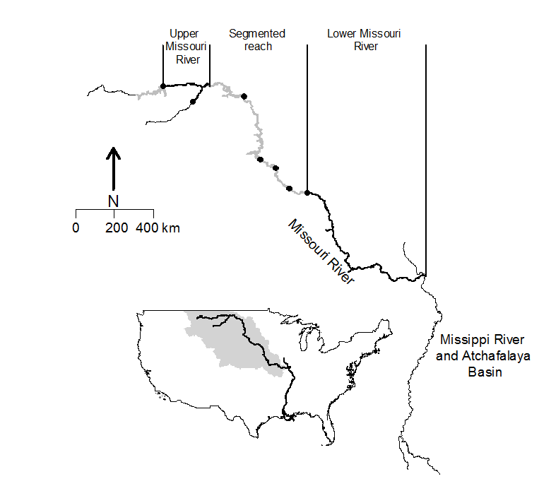
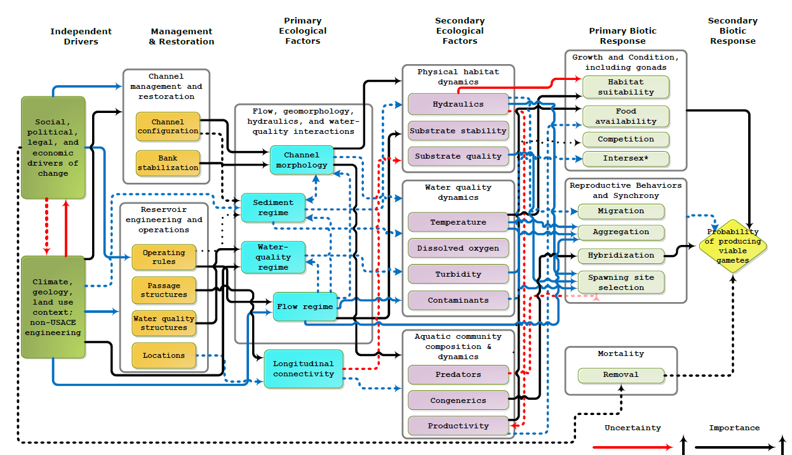
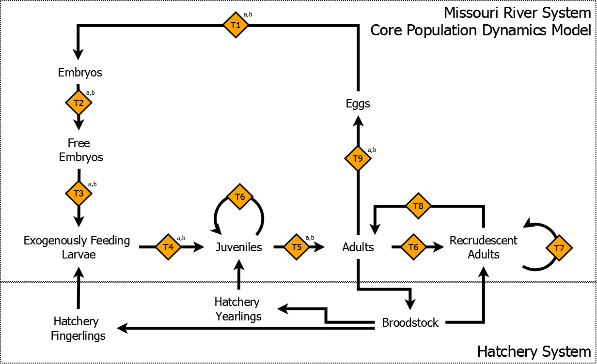

This draft manuscript is distributed solely for purposes of scientific peer review.  Its content is deliberative and predecisional, so it must not be disclosed or released by reviewers.  Because the manuscript has not yet been approved for publication by the U.S. Geological Survey (USGS), it does not represent any official USGS finding or policy.


## Introduction

The objectives of this study were to:
1.	Document modeling framework
2.	Demographic conditions resulting in a growing population ($\lambda$ > 1, Eigen analysis) 
3.	Sensitivities and elasticities
4.	Evaluate levels of population augmentation that 
lead to $\lambda$ > 1 ($\lambda$ as defined by $N_{t+1}/N_{t}$)


## Methods

###Study area and geographic scope
Pallid Sturgeon historically occupied the thousands of kilometers of the Missouri River and its tributaries (Figure 1).  The historically contiguous stream habitat was fragmented by dams sited on the Missouri River and its major tributaries.  Specifically, five dams were constructed without fish passage on the Missouri River during the mid-1900s to provide flood control, navigation, irrigation, hydroelectric, and recreational services.  In 1905 a large diversion dam was placed on the Yellowstone River approximately 113 km upstream from the confluence with the Missouri River.   Five stream segments emerged on the Missouri River from dam placements including:  RPMA4) the lower basin extending 1298 km from the confluence with the Mississippi River to Gavins Point Dam (rkm 0 to 1298), RPMA3) the segmented reach extending 926 km and containing Gavins Point, Big Bend, Oahe, and Garrison Dams (rkm 1298 to 2224), and RPMA 2) the upper basin (611 km) containing the Missouri River upstream of Garrison Dam (rkm 2224 to 2835) and the Yellowstone River from the confluence with the Missouri River to intake dam (rkm 0 to 112), and RPMA1) the Missouri River upstream of Fort Peck Dam (rkm xxxx) (Figure 2).  Naturally produced Pallid Sturgeon are believed to be few or functionally extirpated in the segmented reach of the Missouri River (RPMA 3) because of insufficient spawning and larval drift habitat [cite?].  Therefore recovery efforts described in this study are restricted to RPMA 4 and 2 (hereafter referred to as lower and upper basin respectively) which provide the geographic boundaries and spatial organization of this model.  

### Model overview and spatial organization

The conceptual population model structure was developed to meet three objectives: 1) provide a quantitative framework to forecast pallid sturgeon population dynamics given inputs and life history stages from the CEMs described by Jacobson et al. (2014) (Table 1), 2) provide a flexible model structure template that can be used to model upper and lower basin populations, and 3) account for whether a pallid sturgeon were produced in the Missouri River System or the hatchery system (Figure 2).  A secondary consideration in the development of the model structure was the availability of biological data commonly collected during population assessments (e.g., size, weight, age, sex, origin), which will be necessary to parameterize the model and allow the model to inform monitoring efforts.  

The model is an individual based model of Pallid Sturgeon populations in RPMA2 and 4.  The upper and lower bounds of RPMA 2 and 4 provide the spatial extent of the model simulations.  The spatial grain are river bends used by the population assessment program (PSPAP) (Welker and Drobish 2012b, a).  Bends are defined as three contiguous habitat units, a channel cross-over, inside bend, and outside bend.  Bends begin on the upriver point at the main channel cross-over macrohabitat, ending just above the downstream main channel cross-over. There are 156 and 316 bends defined for RPMA 2 and 4 respectively.   Mean length of bends of RPMA 4 was 4.0 km (varying from 0.16 to 19 km), and mean bend length in RPMA 2 was 2.3 km (varying from 0.64 to 8.0 km).  

### Model overview
Core and plugins, spatially explicit (yes/no), recruitment (yes/no)…

#### Stage-structured cohort models
We used cohorts organized by early life history stages as a framework to 
model population dynamics (Figure 2). Seven stages were used in the 
model to capture biologically important pallid sturgeon stage 
transitions similar to those identified by Wildhaber et al. (2011) and 
correspond to life stage-specific CEMs (Jacobson et al. 2014) (Table 1). 
Pallid Sturgeon life history in the Missouri River System was organized 
into stages defined in Table 1. We modeled Pallid Sturgeon population 
dynamics by transitioning groups or individual fish from one life stage 
to another in a directed fashion illustrated in Figure 2. Within the 
model life stages occurring before age-1 were treated as cohorts and 
once a cohort reached age-1 the number in that cohort was expanded to 
represent individuals. This approach treats life stages prior to age-1 
as super individuals and was used for computation efficiency (Scheffer 
et al. 1995). The number of fish transitioned from one stage to another 
stage was modified by a probability (e.g., survival, maturation). 


#### Cohort dynamics (Eggs, Embryos, Free embryos, and age-0 )
Early life stages were modeled as cohorts
Eggs

\[{{[Eggs]}_{bend}}\tilde{\ }\sum\nolimits_{i=1}^{I}{Poisson({{\gamma }_{i,bend}}\cdot [Adults])}\] 	(1)

where
* $[Eggs]$ is the number of eggs produced in a bend,
* $i$ indexes individual fish,
* $\gamma$ is the number of eggs produced by adult $i$,
* $[Adults]$ is an adult Pallid Sturgeon, and
* $bend$ indexes which bend the Pallid Sturgeon is located in .  

Embryos are fertilized oocytes. In its simplest form the number of 
embryos at time t was modeled the contribution of natural and hatchery 
origin spawns as: 


${{[Embryos]}_{cohort}}\tilde{\ }Binomial({{[Eggs]}_{_{cohort}}},~{{\phi }_{T9,cohort,t}})$	(2)

where
$[Embryo]$ is the number of embryos,
$[Eggs]$ is the number of eggs,
${{\phi }_{T9}}$ is the survival probability, and 
$cohort$  indexes the cohort.

Free embryos represent embryos that have escaped predation and other sources of mortality and hatched.  These dynamics occur within a short period of time, week-month, and therefore the number of embryos at time $t$ was modeled as a function of the number of as:

${{[Free\,embryos]}_{cohort}}\tilde{\ }Binomial({{[Embryos]}_{cohort}},{{\phi }_{T2,cohort,t}})$ 	(3)
	
where 
$[Free\,embryos]$ is the number of free embryos in a cohort,
$[Embryos]$ is the number of embryos, 
$\phi_{T2}$ is the survival probability, and
$cohort$ indexes the cohort.

Exogenously feeding larvae pallid sturgeon represent the longest duration life stage modeled during the first year of life, lasting for months.  However this life stage still occurs within the first year of life and therefore the number of exogenously feeding larvae and age-0 at time t is a function of the number of free embryos at time Y as: 

${{[Age-0]}_{cohort}}\tilde{\ }binomial([Free\,embryos],{{\phi }_{T3,cohort}})$ 	(4)

where 
$\[[Ex.\,Feeding\,Larvae]\]$ 	is the number of exogenously feeding larvae in a cohort,
$[Free\,embryos]$ 	is the number of free embryos in a cohort,
$\phi_{T3}$ 	is the survival probability, and
$cohort$ 	indexes the cohort.

### Individual Pallid Sturgeon dynamics (age-1+) 

Keep track of Alive or not, Age in months, Reached sexual maturity, 
Spawn next year, Time since last spawn, location, len, weight . Things 
that vary over time and are indexed with a t Live or dead 


${{Z}_{i,t}}\tilde{\ }Bernoulli({{Z}_{i,t-1}}\cdot {{\phi }_{T8}})$ 	(5)

Maturity
Is a fish sexually mature? 

	${{M}_{i,t}}~\tilde{\ }Bernoulli({{Z}_{i,t-dt}}\cdot \max ({{M}_{i,t-dt}},Maturit{{y}_{i,t}}))$ 	(9)

Will a fish spawn in the next time step

	$SP{{N}_{i,t}}~\tilde{\ }Bernoulli({{Z}_{i,t-dt}}\cdot {{P}_{spawning,i,t}})$ 	(10)

where 
$SPN$ indicated whether a fish is ready to spawn,
$Z$  indicated whether a fish is alive or not,
${{P}_{spawining}}$	is the probability a fish will spawn in the next time step,
$i$ indexes individual fish, and
$t$ indexes time.

Model initialization
The model was initializing in three steps.  First, state variable were specified by stochastically drawing a number from a specified distribution and expanded to represent individual fish (Table xxx).  Second, individual fish were stochastically assigned length, sex, age, and time since last spawn.  Lastly, individuals were stochastically assigned to a river bend given a vector of probabilities calculated from PSPAP data.  Specific details about model initialization can be found in the supplemental information.   

	


## Initializing the model

2 types of data were required: 1) initial stage-specific population 
abundances, 2) demographic values (e.g., sex ratio), to initialize 
cohorts and indviduals 


Values of Age-0 survival required to achieve varying population growth rates ($\lambda$).  

$$\[A=\left[ \begin{matrix}
   0 & {{M}_{i}}\cdot R\cdot {{F}_{i}} & {{M}_{i}}\cdot R\cdot F & \ldots  & {{M}_{i}}\cdot R\cdot F & {{M}_{i}}\cdot R\cdot F  \\
   {{S}_{0}} & 0 & 0 & \ldots  & 0 & 0  \\
   0 & {{S}_{1}} & 0 & \ldots  & 0 & 0  \\
   0 & 0 & {{S}_{2+}} & 0 & 0 & 0  \\
   \vdots  & \ddots  & \ddots  & \ddots  & \ddots  & \ddots   \\
   0 & 0 & 0 & \ldots  & {{S}_{2+}} & 0  \\
\end{matrix} \right]\]
$$

## A framework for evaluating management effects
While this analysis does not explicitly evaluate the effects of specific 
management actions like flow modifications or habitat creations, the 
model was developed such that these effects could be evaluated given 
appropriate inputs to the core population dynamics model, hereafter 
referred to as plugins as information is learned during adaptive 
management. 


### Plugin functions and values
Many sources were used to determine values required by equations 3.1 to 
3.11 and simulate pallid sturgeon population dynamics. Four types of 
data were required: 1) initial stage-specific population abundances, 2) 
demographic values (e.g., sex ratio), 3) demographic rates (e.g., 
survival), and 4) demographic functions (e.g., maturity, fecundity). 
Initial stage-specific abundances for upper and lower basin natural and 
hatchery origin populations used to initialize the population model can 
be found in Table 3.2. Survival estimates and associated range of 
uncertainties and sources used in the simulation model are found in 
Table 3.3. Additional demographic values (e.g., sex ratio), 
uncertainties and sources are found in Table 3.1. Functions relating age 
or time since an event were required to predict additional age or time 
dependent demographic rates. In the simulation model, fecundity (eggs 
per female) was predicted as a function of age (Figure 4) using the 
following: 

2) demographic values (e.g., sex ratio), 
3) demographic rates (e.g., survival)

### Age-0 survival
For early life history stages where no survival estimates exist, 
survivals were randomly selected such that the product equaled age-0 
survival (S_(a=0)). Stage-specific initial abundances were randomly 
selected from triangular distributions generated from minimum, expected, 
and maximum values reported in Tables 3.2 and 3.3. Age-specific 
abundances within each age-class were then stochastically generated 
assuming a stable age distribution. Once fish were allocated to 
age-classes within the adult stage, they were uniformly allocated among 
spawning and recrudescent stages. 

## Evaluating population dynamics and stocking scenarios

### Simulating population dynamics

## Scenarios
The parameterized model was also used to evaluate several scenarios and 
address three questions regarding the upper and lower basin pallid 
sturgeon populations. 


1) What is the population growth rate ($\lambda$) under: A) present 
stocking conditions, and B) No stocking? 

This scenario was evaluated using the same steps of the sensitivity 
analysis with the exception that an additional scenario was added where 
stocking values were set to zero and simulated for the upper and lower 
basin populations. A stochastic growth rate $\lambda$ was calculated for each 
of the 10k replicates as the geometric mean of within replicate annual 
growth rates. 

2) How far to move early life history survival to achieve $\lambda$ ≥ 1 without stocking?

Early life history survival is an important determinant of population 
growth rate and dynamics in fish populations. The use of population 
supplementation can circumvent poor survival of early life history 
stages and maintain or increase population abundances. In this scenario 
the question of how high does early life history survival need to be in 
order to maintain or increase the population (i.e., $\lambda$ ≥ 1) in the 
absence of stocking. This question was evaluated by performing a grid 
search of values for S1 and S_(A=0) (S_(A=0)=S2⋅S3⋅S4). Specifically 
S1 was evaluated for values of 0.001 to 0.003 by increments of 0.002 and 
S_(A=0) was evaluated for values of 0.01 to 0.1 by increments of 0.01 
for the upper and lower basin populations. Stocking values were set at 0 
and the population simulated for a 100 year period. We simulated 100 
replicate model runs for each unique combination of S1 and S_(A=0). The 
mean stochastic $\lambda$ and proportion of the 100 replicates with a mean 
stochastic $\lambda$ ≥ 1 calculated for each combination of S1 and S_(A=0). 
Results were visually assessed for each parameter combination as a 
binary response, whether 95% of the 100 replicates had a stochastic $\lambda$ 
≥ 1. 

## Sensitivity

A sensitivity analysis was used to evaluate the effect of parameter 
uncertainty on population dynamics simulated for the lower and upper 
Missouri River basins. The sensitivity analysis was performed by 
randomly drawing parameters within parameter extremes assuming 
triangular distributions. Randomly selected values were used to 
initialize the population model and the population simulated over a 100 
year period. Population abundance at year 100 was retained for juvenile 
and adult stages of hatchery and natural origin. This process was 
replicated 10k times to capture parameter variability. Yearling stocking 
was set to the basin-specific average values, it was assumed for this 
analysis that fingerling stocking will not continue due to low survival. 
Model parameter values were then assigned to quantiles (0-25, 25-50, 
50-75, and 75-100%). Stage- and origin-specific expected abundances 
(i.e., mean) were calculated for each quantile and used to construct 
tornado plots to visualize how parameter uncertainty contributes to 
variation in abundances at t = 50. Tornado plots are a useful tool for 
visualizing the effect of parameters on model output, population 
abundance at t = 50 in this case, and are commonly used evaluate model 
sensitivity (Conroy and Peterson 2013). 

## Results

### Sensitivities

Stage-specific sensitivity analyses for expected population abundance in 
year 100 varied between upper and lower Missouri River pallid sturgeon 
populations simulated. The expected number of natural origin adults in 
year 100 was most sensitive to early life history survival for the upper 
basin, and a mix of hatchery origin adult abundance, early life history 
survivals and sex ratio for the lower basin (Figure 3.7). Similar 
patterns of parameter sensitivity resulted for natural origin juveniles 
(Figure 3.8). Hatchery origin adults and juvenile sensitivities also 
varied between basin with juvenile survival playing a role in upper 
basin population dynamics, and a mix of factors in the lower basin 
(Figure 3.9 and 3.10). Similarly sensitivity results varied between 
basin for total population abundance, with a stronger influence of 
hatchery supplementation in lower basin, followed by early life history 
survival, sex ratio, adult abundance (i.e., factors linked in embryo 
production) (Figure 3.10). While the upper basin dynamics were sensitive 
to early life history survival and sex ratio. 

### Scenarios 
1) What is the population growth rate ($\lambda$) under: A) present 
stocking conditions, and B) No stocking? 


Population dynamics given the degree of uncertainties in model 
parameters exhibited variable dynamics. Under average stocking 
scenarios, populations tended to increase for all stages and basins 
(Figures 3.12 to 3.15). The majority of replicates tended to decline 
over the 100 year simulations for natural origin juvenile and adult 
stage pallid sturgeons with the cessation of stocking, especially after 
existing hatchery origin fish senescence out of the systems (Figures 3.12 
and 3.13). There were certain parameter combinations that resulted in 
increasing abundance of natural origin fish under no stocking scenarios. 
As expected, hatchery origin fish abundance decline to 0 over the 100 
year simulations (Figures 3.13 and 3.14). Evaluating distributions of 
growth rates for each scenario, all stocking scenarios had a growth rate 
greater than 1 (Figure 3.16). With the cessation of stocking, upper 
basin simulations were more likely to have a growth rate less than 1 and 
approximately 50% of the simulations for the lower basin had growth 
rates less than 1. 

2) How far to move early life history survival to achieve $\lambda$ ≥ 
1 without stocking? 


There was uncertainty in how much critical survival parameters need to 
increase in order to achieve a population growth rate greater than 1. 
Varying combinations of S1 and S_(A=0) can achieve a population growth 
rate greater than 1 given the parameters used to model the population. 
In general, simulations indicated that combinations of S1 exceeding 
0.0012 and S_(A=0) exceeding 0.02 for the upper basin and S1 exceeding 
0.001 and S_(A=0) exceeding 0.02 for the lower basin resulted in 
positive population growth under stocking conditions simulated. 

3) Depensation effect can we assess population needed to get past 
critical depensation? 


The population model was flexible enough to accommodate evaluation of a 
depensation scenario relating spawning population abundance to embryo 
production. But to reiterate the underlying functional relationship 
relating a depensatory effect of spawning population abundance on embryo 
production is uncertain and results are therefore unreliable. Relative 
to previous stocking and no stocking scenarios, simulating the same 
scenarios including a depensatory effect of population size on embryo 
production resulted in lower total population abundances and reduced 
population growth rates (Figure 3.6). 

References
Conroy, M. J., and J. T. Peterson. 2013. Decision making in natural resource management: a structured, adaptive approach. Wiley.
Jacobson, R. B., M. J. Parsley, M. L. Annis, M. E. Colvin, T. L. Welker, and D. James. 2014. Development of Conceptual Ecological Models Linking Management of the Missouri River to Pallid Sturgeon Population Dynamics.
Keenlyne, K. D. 1997. Life history and status of the shovelnose sturgeon, Scaphirhynchus platorynchus. Environmental Biology of Fishes 48:291-296.
Scheffer, M., J. M. Baveco, D. L. DeAngelis, K. A. Rose, and E. H. van Nes. 1995. Super-individuals a simple solution for modelling large populations on an individual basis. Ecological Modelling 80:161-170.
Steffensen, K. D., M. A. Pegg, and G. Mestl. 2013. Population prediction and viability model for pallid sturgeon (Scaphirhynchus albus, Forbes and Richardson, ) in the lower Missouri River. Journal of Applied Ichthyology 29:984-989.
Welker, T. L., and M. R. Drobish. 2012a. Missouri River standard operating procedures for fish sampling and data collection. U.S. Army Corps of Engineers.
Welker, T. L., and M. R. Drobish. 2012b. Pallid sturgeon population assessment project, guiding document. U.S. Army Corps of Engineers.
Wildhaber, M. L., A. J. DeLonay, D. M. Papoulias, D. L. Galat, R. B. Jacobson, D. G. Simpkins, P. J. Braaten, C. E. Korschgen, and M. J. Mac. 2011. Identifying structural elements needed for development of a predictive life-history model for pallid and shovelnose sturgeons. Journal of Applied Ichthyology 27:462-469.

# Figures

```{r echo=FALSE, out.width="95%"}

```

Figure 1. Missouri River drainage (denoted by grey area) and Mississippi 
River Pallid Sturgeon recovery areas described in this study. Black 
circles denote dams without fish passage. Black lines denote Missouri 
River segments used to delineate Pallid Sturgeon populations. ADD RPMAs, 
do at 600 dpi 

```{r echo=FALSE, out.width="95%"}

```
Figure 2.  Illustration of a conceptual ecological model  (Jacobson et al. 2014)… (See appendix or XXX for all conceptual ecological documents


```{r echo=FALSE, out.width="95%"}

```


Figure 2.  Conceptual model of life history stages represented in the population dynamics model.  Transitions denoted with an a and b were have corresponding conceptual ecological models predicting the effect of management actions on survival rates.  
  
*Fix fingerlings and yearlings to match table 1, drop adults and 
juveniles for age-1+, specify cohort and individual based portions of 
the model, and have 3 for no recruitment, recruitment, and spatially 
explicit*


## Appendix-XX Model plugins

### Overview

Types of plugins: 
initialization, 
transition- survival, maturity, so on Boxes
dynamics- growth, so on

Initialization
Length, weight, age initialization
* Basin specific
* PSPAP data
* Reduce to below of  L  >  L_inf 
* Assign weight
* Assign age given 7mm at hatch
* Assign location given PSPAP densities at segment level, randomized within segment
* Assign 
* Draw L_inf and k from MVN distribution for upper and lower basin

$$\[\left( \begin{matrix}
   \ln {{L}_{\infty ,i}}  \\
   \ln {{k}_{i}}  \\
\end{matrix} \right)\tilde{\ }MVN\left( \left( \begin{matrix}
   {{\mu }_{\ln ({{L}_{\infty }}),basin}}  \\
   {{\mu }_{\ln (k),basin}}  \\
\end{matrix} \right),\left( \begin{matrix}
   \sigma _{^{_{\ln ({{L}_{\infty }}),basin}}}^{2} & {{\sigma }_{\ln ({{L}_{\infty }}),basin}}\cdot {{\sigma }_{\ln (k),basin}}  \\
   {{\sigma }_{\ln (k),basin}}\cdot {{\sigma }_{\ln ({{L}_{\infty }}),basin}} & \sigma _{_{\ln (k),basin}}^{2}  \\
\end{matrix} \right) \right)\] 	(xx)$$

* $L_{\infty ,i,t=0}\tilde$ 
* $k_{i,t=0}\tilde$ 
* $F{{L}_{i,t=0}}\tildegeneratedfromdata$
* $Origi{{n}_{i,t=0}}=$ 
* ${{A}_{i,t=0}}=inverseofvbgf$

### State transitions


Dynamics
How many months since the fish spawned?

$$ \[MP{{S}_{i,t}}=(MP{{S}_{i,t-dt}}+1)({{Z}_{i,t}}\cdot (1-SP{{N}_{i,t-dt}}))\] $$

Where,
$MPS$ is the month since spawning,
$Z$ is an indicator of whether a fish is alive or not,
$SPN$ is an indicator of whether a fish is read to spawn,
$dt$ is the model time step,
$i$ indexes individual fish, and 
$t$ indexes time.

Fork length

$F{{L}_{i,t}}\tilde{\ }LN(F{{L}_{i,t-1}}+dF{{L}_{i,t}},\sigma )$ 	(6)

Weight

${{W}_{i,t}}\tilde{\ }LN(\widehat{{{W}_{i,t}}},{{\sigma }_{weight}})$ 	(7)

Age

${{A}_{i,t}}=({{A}_{i,t-dt}}+1)\cdot {{Z}_{i,t}}$ 	(8)

Growth
	$d{{L}_{i,t}}=VBGF$ 	(xxx)
where
	$FL$ 	is fork length
	${{L}_{\infty }}$ 	is fork length at infinite age
	$k$ 	is the rate that a fish approaches ${{L}_{\infty }}$
	$dt$ 	is the model time step
	$i$ 	indexes individual fish
	$t$ 	indexes time

Weight
	\[{{W}_{i,t}}={{e}^{{{a}_{rpma}}+{{b}_{rpma}}\cdot F{{L}_{i}}+{{\epsilon }_{i}}}}\]	(xxx)
	$W$ 	is fish weight
	$\alpha$ 	is the intercept of the log-linear relationship of length and weight
	$b$  	is the effect of length on weight
	$FL$ 	is fork length
	$\epsilon ~$	is a normally distributed with mean 0 and standard deviation ${{\sigma }_{weight,basin}}$
	$rpma$ 	indexes Missouri River RPMA
	$i$ 	indexes individual fish
	$t$ 	indexes time

   Sexual maturity

4) demographic functions (e.g., maturity, fecundity)
Spawning
$SP{{N}_{i,t}}~\tilde{\ }bernoulli({{\eta }_{i,t}})$
$\operatorname{logit}({{\eta }_{i,t}})=a+b\cdot MP{{S}_{i,t}}$
 
A sexual maturity function which calculated the probability of a 
juvenile fish transitioning to an adult fish as a function of age. This 
function was parameterized to reflect the minimum and maximum age at 
sexual maturity reported by Keenlyne (1997). Similarly, the probability 
of a recrudescent adult returning to sexual maturity was predicted as a 
function of years post spawning (Figure 3.5). These probabilities were 
selected to approximate the a spawning interval of 2.5 years (Steffensen 
et al. 2013). 


### Fecundity

	\[{{\gamma }_{i,t}}=\left( {{e}^{\text{ }\!\!\alpha\!\!\text{ }+\text{ }\!\!\beta\!\!\text{ }\cdot {{L}_{i}}+\epsilon }} \right)\cdot \left( {{Z}_{i,t}}\cdot Se{{x}_{i}}\cdot SP{{N}_{i,t}} \right)\] 	(12)

where 
	$\gamma$ 	is the expected number of eggs produced
	$\alpha$ 	is the intercept of the log-linear equation relating length and fecundity
	$L$ 	is the total fish length
	$\beta$ 	is the effect of length on fecundity
	$\epsilon$ 	is a normally distributed value with mean 0 and standard deviation ${{\sigma }_{fecundity}}$
	$Z$ 	indicates whether a fish is alive or not
	$Sex$ 	indicated whether a fish is female or not
	$Spawn$ 	indicated whether a fish will spawn or not
	$i$ 	indexed individual fish
	$t$ 	indexed time


 
 
 ## R-code used to solve for varying population growth rates
Lower Missouri River Basin

Upper Missouri River Basin

Functions to make things easier

```{r}
### CODE TO FIT A MATRIX MODEL TO DETERMINE A LAMBDA OF 1
mat<- function(maxAge,fec,surv)
  {
    maxAge<-maxAge+1# account for age0
    A<- matrix(0,nrow=maxAge,ncol=maxAge)
    A[1,]<- c(0,fec)
    A[cbind(c(3:maxAge),c(2:(maxAge-1)))]<-surv
    return(A)
    }

age0<- function(p,mat,lam)
    {
    mat[2,1]<-exp(p)/(1+exp(p))
    lambda<-Re(eigen(mat)$values[1])
    out<-(lam-lambda)^2
    return(out) 
    }

```

Run the code
```{r}
AA<-mat(maxAge=42,fec=rep(5,42),surv=rep(0.92,41))

val<-optimize(age0,interval=c(-30,0),mat=AA,lam=0.9)
exp(val$minimum)/(1+exp(val$minimum))# value as probability

```
# Fecundity appendix

| Predictor 	| Type         	|      Beta0              	|    Beta1        	| Source                     	| Comments                                       	|
|-----------	|--------------	|:----------------------:	|:-------------:	|----------------------------	|------------------------------------------------	|
| Length    	| Log10-linear 	|         4.1724         	|     0.0005    	| (Albers et al. 2013)       	| 740-1116 mm; n=47;                             	|
|           	|              	|          4.072         	|     0.0006    	| (Albers et al. 2013)       	| 740-1116 mm; n=53; combined with other data    	|
|           	| Loge-linear  	|         -288463        	|     110056    	| (Bajer and Wildhaber 2007) 	| Shovelnose                                     	|
|           	| linear       	| −45,224.64 ± 24,709.94 	| 83.69 ± 25.85 	| (Wildhaber et al.)         	| N=44; 2006 to 2013; Lower Missouri River only; 	|
|           	|              	|         -43678         	|      72.7     	| (Steffensen et al. 2013)   	| 788-1079 mm; n=12                              	|
| Weight    	| Linear       	|          2089          	|      6.39     	| (Steffensen et al. 2013)   	| 2014-5450 g; n=12                              	|
Shovelnose: 660x1-exp(-0.191x(i+0.269) )(Bajer and Wildhaber 2007) originally from (Quist et al. 2002)


Albers, J. L., M. L. Wildhaber, and A. J. DeLonay. 2013. Gonadosomatic index and fecundity of Lower Missouri and Middle Mississippi River endangered pallid sturgeon estimated using minimally invasive techniques. Journal of Applied Ichthyology 29:968-977.
Bajer, P. G., and M. L. Wildhaber. 2007. Population viability analysis of Lower Missouri River shovelnose sturgeon with initial application to the pallid sturgeon. Journal of Applied Ichthyology 23:457-464.
Quist, M. C., C. S. Guy, M. A. Pegg, P. J. Braaten, C. L. Pierce, and V. H. Travnichek. 2002. Potential influence of harvest on shovelnose sturgeon populations in the Missouri River system. North American Journal of Fisheries Management 22:537-549.
Steffensen, K. D., M. A. Pegg, and G. E. Mestl. 2013. Population characteristics of pallid sturgeon (Scaphirhynchus albus (Forbes & Richardson, 1905)) in the Lower Missouri River. Journal of Applied Ichthyology 29:687-695.
Wildhaber, M. L., J. L. Albers, N. S. Green, and E. H. Moran. A fully-stochasticized, age-structured population model for population viability analysis of fish: Lower Missouri River endangered pallid sturgeon example. Ecological Modelling.


# Hatchery operations

Notes.
* Collection started May 5th 2014 for USFWS and MTFWP, May 18th in 2015

Table 1. Months when are fish are spawned? 1992-2014 data.

| RPMA 	| Month 	| Females spawned 	|
|:----:	|:-----:	|:---------------:	|
|   2  	|   5   	|        1        	|
|      	|   6   	|        40       	|
|      	|   7   	|        15       	|
|   4  	|   4   	|        13       	|
|      	|   5   	|        6        	|
|      	|   6   	|        21       	|
|      	|   7   	|        14       	|


Table 2.  What hatchery sources are fish from that are stocked into RPMA 2 and 4? 1992-2014 data.
| Hatchery     	| RPMA 2 	| RPMA 4 	|
|--------------	|--------	|--------	|
| Blind Pony   	|        	| x      	|
| Bozeman      	| x      	|        	|
| Fort Peck    	| x      	|        	|
| Garrison     	| x      	| x      	|
| Gavins Point 	| x      	| x      	|
| Miles City   	| x      	|        	|
| Neosho       	|        	| x      	|

Table 3. Summary of the number of fish stocked into RPMA 2 and 4 by age 
at stocking and year outplanted into the river. 1992-2014 data. 
<!--
Pull and kable from dbase
-->

Table 4. Numbers of days post hatch for age at stocking classification.
| RPMA 	| Age at stocking 	| DPH Mean 	| DPH min 	| DPH max 	| Size (mm) 	|
|------	|-----------------	|----------	|---------	|---------	|-----------	|
| 2    	| fry             	| 28       	| 4       	| 69      	|           	|
|      	| fingerling      	| 88       	| 52      	| 113     	|           	|
|      	| adv. fing.      	| 119      	| 77      	| 150     	|           	|
|      	| yearling        	| 316      	| 264     	| 490     	|           	|
|      	| 2 yr old        	| 853      	| 853     	| 853     	|           	|
|      	| 6 yr old        	| 2266     	| 2266    	| 2266    	|           	|
| 4    	| fingerling      	| 148      	| 64      	| 202     	|           	|
|      	| yearling        	| 392      	| 281     	| 545     	|           	|
|      	| 2 yr old        	| 671      	| 626     	| 706     	|           	|
|      	| 3 yr old        	| 1109     	| 1044    	| 1236    	|           	|
|      	| 5 yr old        	| 1774     	| 1774    	| 1774    	|           	|
|      	| 6 yr old        	| 2126     	| 2126    	| 2126    	|           	|
|      	| 7 yr old        	| 2521     	| 2521    	| 2521    	|           	|