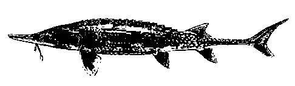

### PLEASE READ

THIS MODEL VERSION SHOULD NOT BE USED FOR ANY TYPE OF ANALYSIS.  THIS VERSION IS INTENDED TO DEMONSTRATE HOW THE POPULATION MODEL AND BACKGROUND INFORMATION MAY BE PACKAGED AND AVAAILBLE TO STAKEHOLDERS.   

### Background

The U.S. Army Corps of Engineers and the U.S. Fish and Wildlife Service recently initiated an effects analysis (EA) for the Missouri River Recovery Program (MRRP).  The EA was strongly encouraged by the Missouri River Recovery Implementation Committee (MRRIC) and the MRRIC Independent Science Advisory Committee (ISAP) as a means to review recovery progress, provide quantitative models relating endangered species’ responses to management actions, provide a foundation for structured decision making, and to create a framework for continued monitoring and assessment through adaptive management. 

