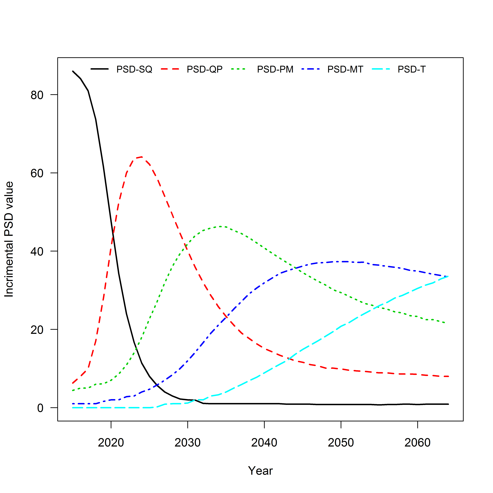
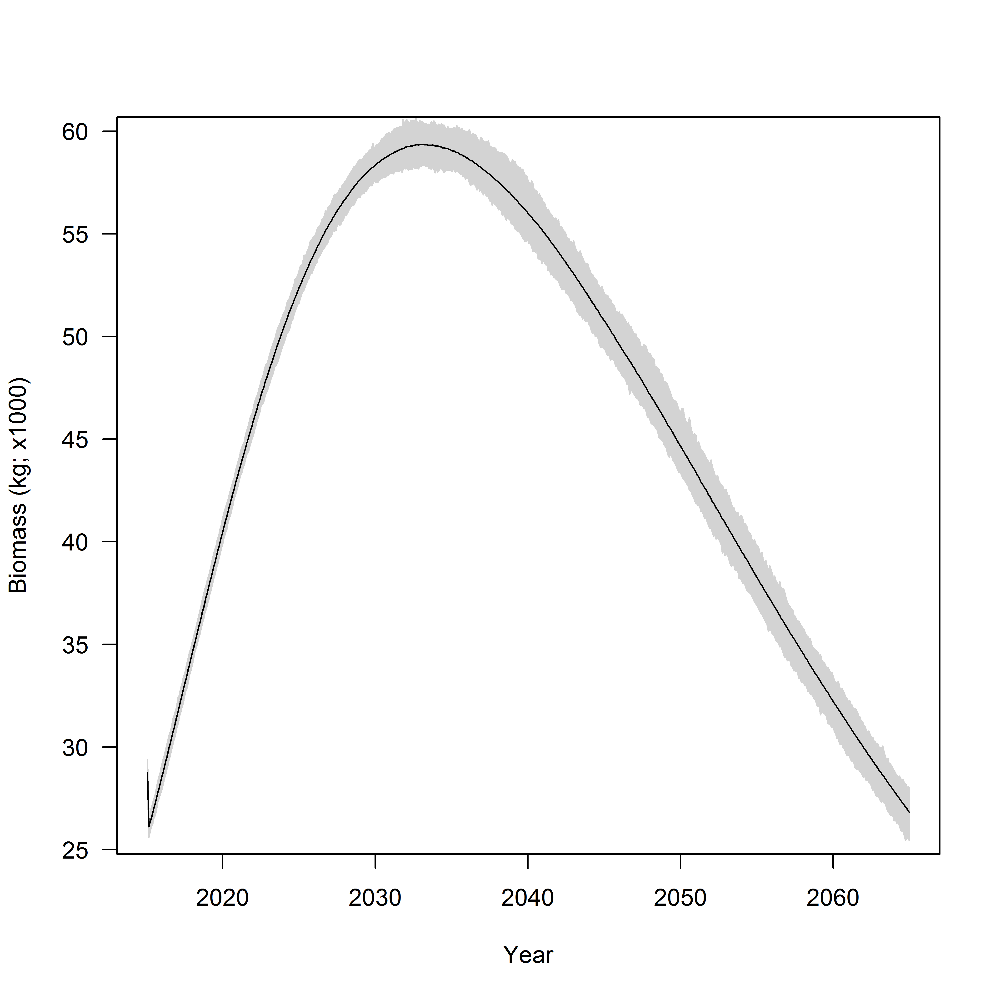
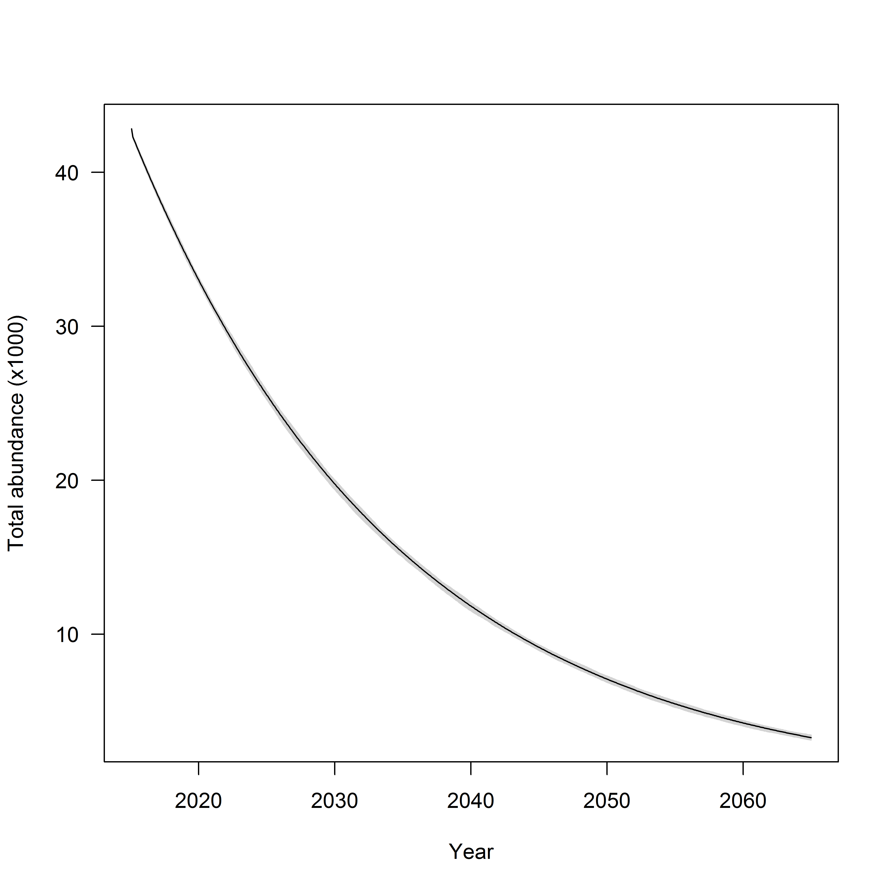
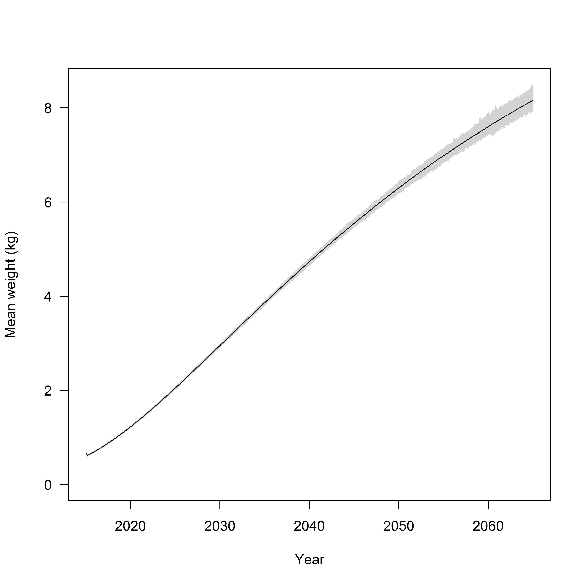
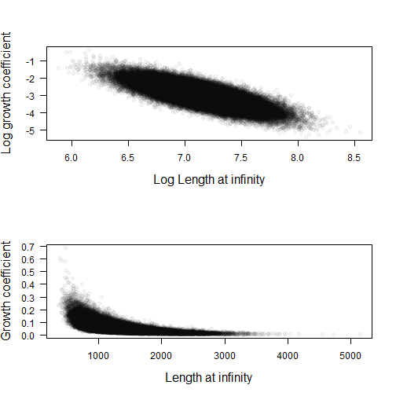
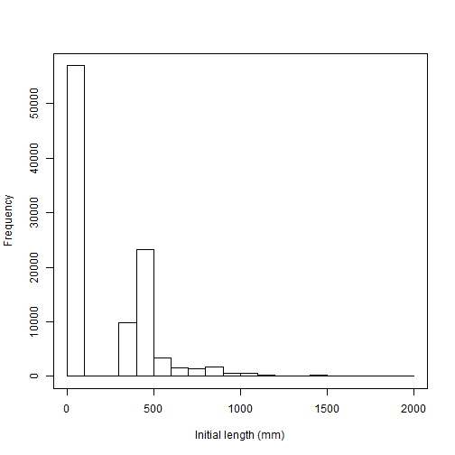

## Analysis metadata
Requestor:  Steve Krentz USFWS  
Analyst: Mike Colvin MS State  
Analysis ID: 2016-001  
GitHub commit reference: 32fb39b  
Inputs file: 2016-001-inputs.txt  
Outputs file: 2016-001-output.txt    

## Analysis overview 

This analysis was initiated to evaluate and verify trends in size structure indexed by proportional size distributions (PSD) using the Pallid Sturgeon model developed as part of the effects analysis.  

## Relevant analysis methods^1^

1. Adult population initialized in with 43,012 fish.  All fish assumed to be hatchery origin, this assumption is inconsequential in the model for this exercise
2. These fish were randomly assigned a length from the empirical distribution of lengths calculated from PSPAP assessments for RPMA2
3. Survival was set to 0.95 for ages 1-60 (max age)
4. There was no natural recruitment or stocking
5. PSD values calculated given standard PSD sizes for Pallid Sturgeon
6. Growth (i.e., change in length over time) and weight of individuals was simulated using RPMA2 specific VBGF
parameters and length-weight relationship estimated from PSPAP data.
7. Total biomass over time was calculated as the sum of the weight of all individuals at a given time step.
8. Simulations run over a 50 year period, monthly time steps, 100 stochastic replicates

## Provisional results^2^

* Incremental PSD values transitioned from the majority of Pallid Sturgeon being PSD-SQ to PSD-QP (Figure 1; Table 1). 
Size structure shifts to larger fish with higher relative frequencies due to survival and growth.
* Increases in PSD-PM, PSD-MT, and PSD-T were observed in simulations, although size
structure stabilized around 2045 (Figure 1).
* Total biomass of RPMA2 is projected to exceed 60,000 kg by 2030 given model inputs (Figure 2). Biomass declines after
peak biomass due to the interaction of growth and survival (i.e., number of biomass lost to senescence exceeds growth).
* Total abundance is expected to decrease to approximately 3,300 individuals over the next 50 years 
given model inputs (Figure 3)

___
^1^Methods describe and detail relevant information required to replicate analysis using the Pallid Sturgeon Population model.
Exact model details are in progress of write up for publication which will serve as the primary citation for 
the model used in these analyses.  
^2^Results provided may be subject to revision as the model 
is still under development and therefore all results should 
be considered provisional.

## Figures

 

Figure 1.  Simulated Pallid Sturgeon incremental proportional stock density (PSD) 
values (_y_-axis) versus year (_x_-axis) for RPMA2.

 

Figure 2.  Total simulated Pallid sturgeon biomass (_y_-axis) 
and year (_x_-axis) for RPMA2. Grey area denotes simulation 
envelope for 100 stochastic replicates.  

 
  

Figure 3.  Expected total Pallid Sturgeon 
abundance for RPMA2.  Grey area denotes simulation 
envelope for 100 stochastic replicates.  

 
 
Figure 4.  Mean individual weight of simulated RPMA2 Pallid Sturgeon.  
Grey area denotes simulation envelope.

## Tables

Table 1.  Expected incremental PSD values for simulated Pallid Sturgeon population in RPMA2. Values
are means of stochastic replicates and therefore may not sum to 100.

   

|PSD    | 2015| 2025| 2050| 2065|
|:------|----:|----:|----:|----:|
|PSD-SQ |   86|    8|    1|    1|
|PSD-QP |    6|   62|   10|    8|
|PSD-PM |    4|   23|   29|   22|
|PSD-MT |    1|    5|   37|   33|
|PSD-T  |    0|    0|   21|   34|

## Inputs summary

* Analysis Metadata 
    * Analysis ID: 2016-001 
    * GIT Commit: 32fb39b  
* Population characteristics 
    * Total population: 43012 
    * Initial ratio: 0.5 
    * Maximum age: 60 
    * Size at hatch (mm): 7  
* Size and growth 
    * Length-weight 
        * a: 7.6e-07 
        * a' (ln): -14.09 
        * b: 3.24 
        *  $\sigma$: 0.16  
    * Growth 
        *  $\mu_{L_{\infty}}$: 1256.43 
        *  $\mu_{k}$: 0.05 
        *  $ln(\mu_{L_{\infty}})$: 7.14 
        *  $ln(\mu_{k})$: -3 
        *  $\sigma_{ln(\mu_{L_{\infty}})}$: 0.3 
        *  $\sigma_{ln(\mu_{k})}$: 0.56 
        * Correlation  of $ln(\mu_{L_{\infty}})$ and $ln(\mu_{k})$; ($\rho$): -0.79   

<!-- end of list -->

 

Figure A.1. Distribution and relationship of VBGF parameters used to model fish growth.  Each 
point represents the $L_{\infty}$ and $k$ value stochastically assigned to an 
indvidual fish on log scale (top panel) and real scale (bottom panel)

 

Figure A.2. Distribution of initial lengths assigned to indvidual Pallid Sturgeon.  
