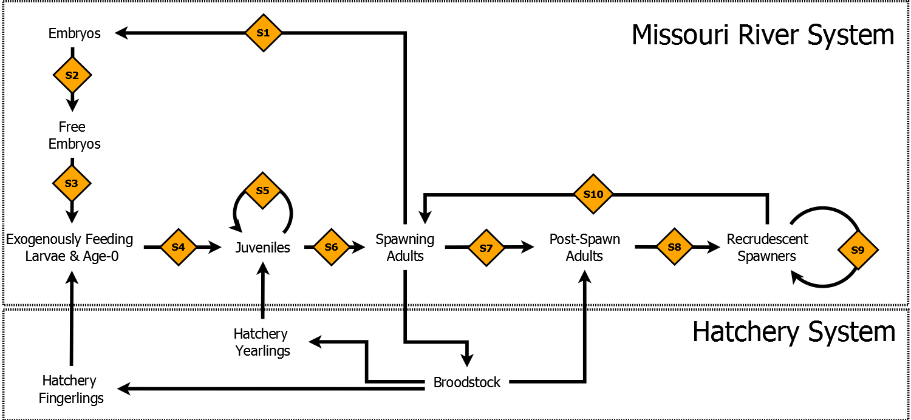

### Model details

#### Objective
The population model structure was developed to meet three primary objectives: 1) provide a quantitative framework to forecast pallid sturgeon population dynamics given inputs from the CEMs described by Jacobson and others (2014a), 2) provide a flexible model structure template that can be used to model several populations (that is, upper river, lower river, and sub populations if identified) and varying spatial resolutions, and 3) account for whether pallid sturgeon were produced in the Missouri River System or the hatchery system (fig. 1).  A secondary consideration in the development of the model structure was the availability of biological data commonly collected during population assessments (for example, size, weight, age, sex, origin), which will be necessary to parameterize and potentially calibrate the model.  It should be recognized that this population modeling effort is a work in progress and will be modified as needed to meet the needs of the EA as well as input from regional pallid sturgeon experts.  

<i>Figure 1.&mdash;Generalized stage-based conceptual model used to develop a quantitative pallid sturgeon population model. The text boxes denote life history stages contained in the model. Arrows reflect transitions (that is, flows) from one stage to another. Gold diamonds represent survival rates, reflecting growth, maturation
</i>

